# 🚀 Hirely – Recruiter Dashboard & Candidate Management System

Hirely is a full-stack recruiter workflow management platform designed to streamline candidate tracking, hiring pipeline monitoring, and recruiter operations through an interactive dashboard interface.

The system enables recruiters to manage applicants efficiently with structured hiring stages, centralized candidate records, and scalable media storage using AWS S3 integration.

---

# 📌 Project Overview

Hirely provides a recruiter-centric interface that simplifies the hiring lifecycle from candidate submission to final selection.

Core capabilities include:

- Recruiter dashboard
- Candidate profile management
- Job posting system
- Application tracking workflow
- Resume/media storage using AWS S3
- Company profile management
- Recommendation insights interface

---

# 🛠️ Tech Stack

Frontend
- React
- JavaScript
- CSS
- Vite

Backend
- Django
- Django REST Framework

Cloud Storage
- AWS S3

Database
- SQLite (development)
- PostgreSQL ready architecture

Tools
- Git
- npm
- Python

---

# ✨ Features

✔ Recruiter dashboard interface  
✔ Job posting system  
✔ Candidate application tracking  
✔ Company profile management  
✔ Resume upload with AWS S3 integration  
✔ Authentication system (Login / Register)  
✔ Recommendation module  
✔ Modular scalable architecture  

---

# 🖥️ Application Screenshots

## Home Page
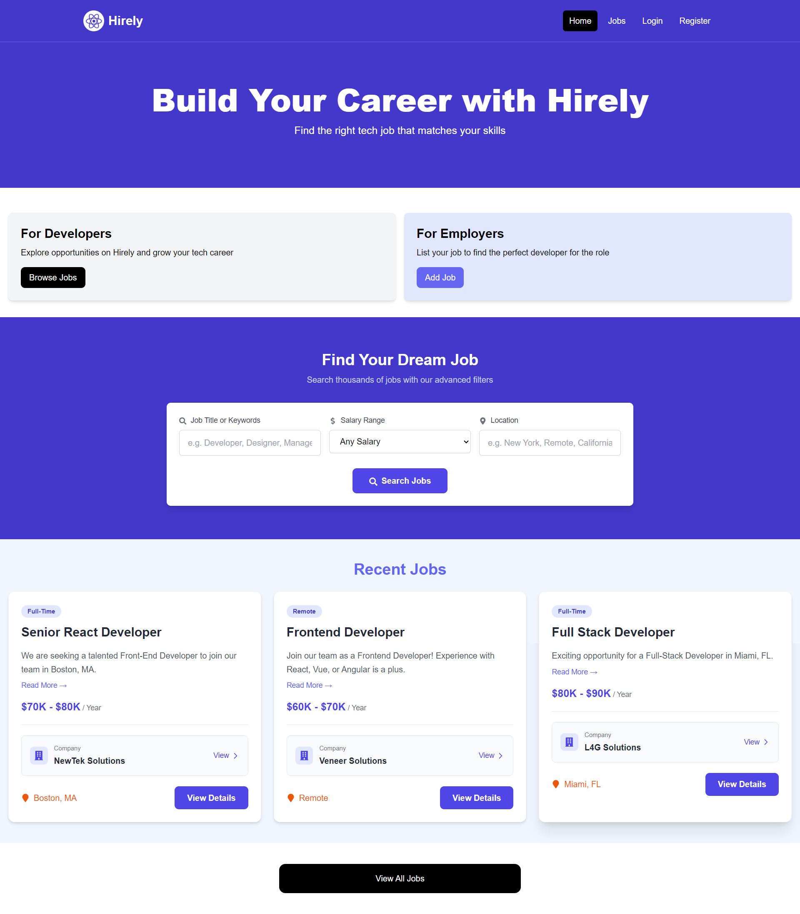

## Login Page
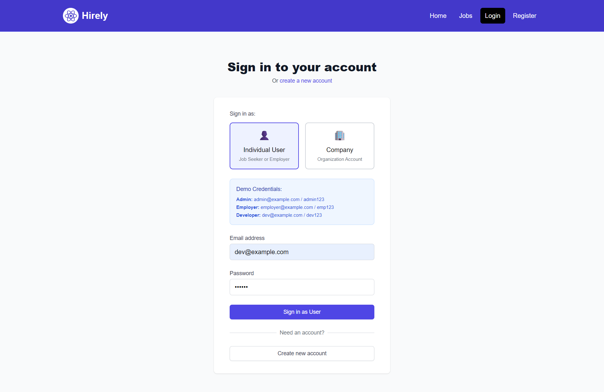

## Register Page
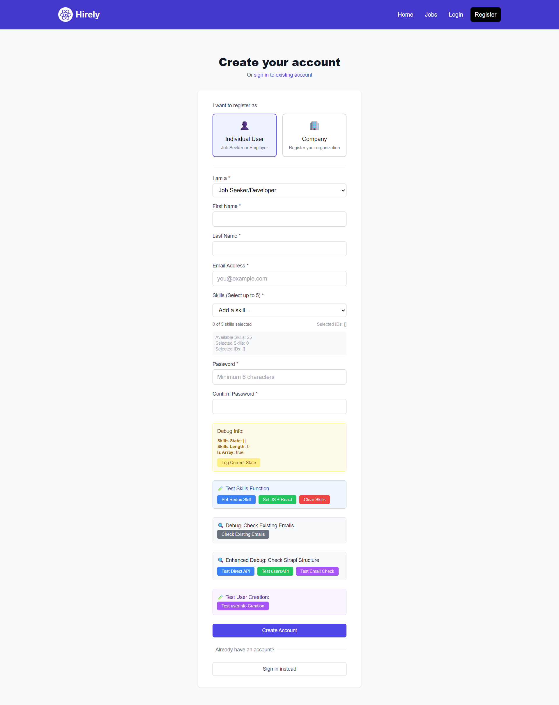

## Company Dashboard
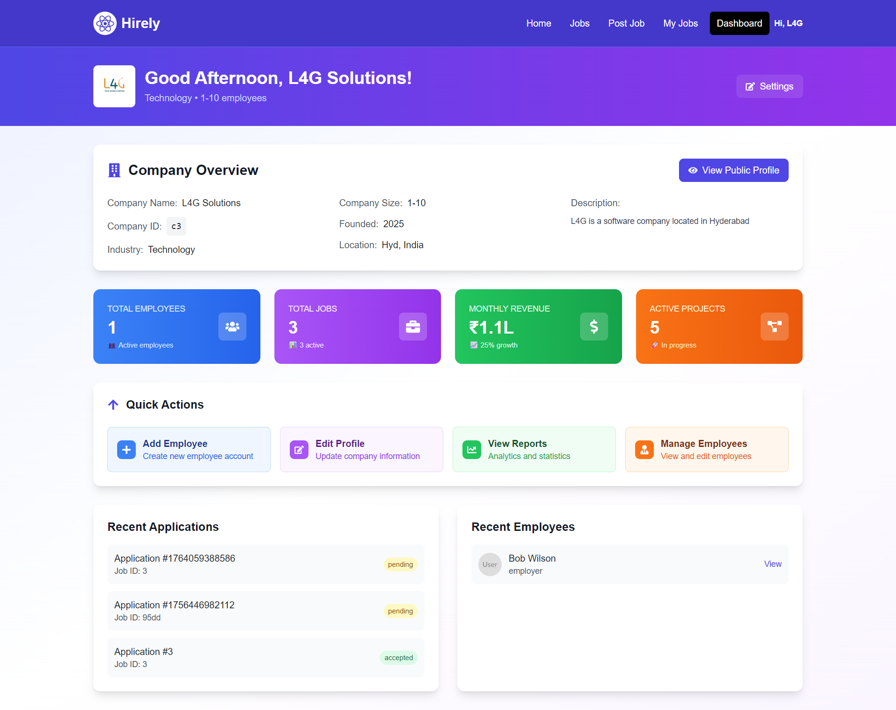

## Company Profile Page
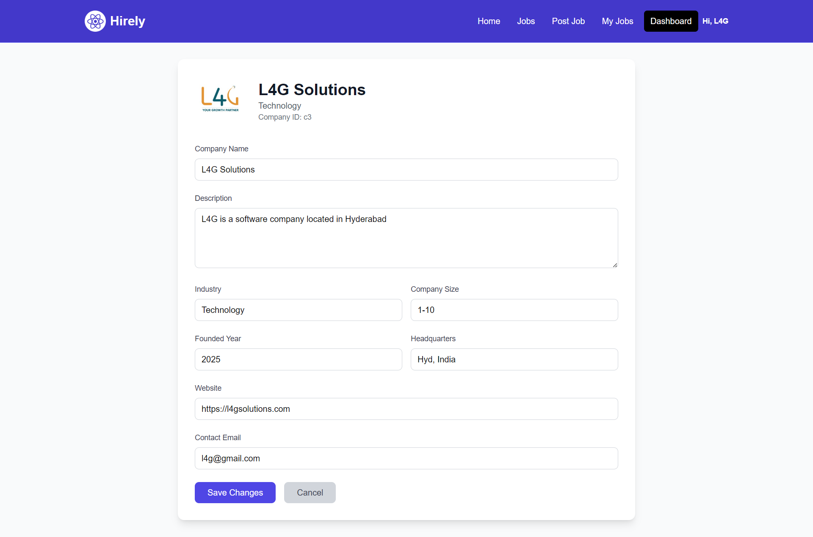

## Jobs Page
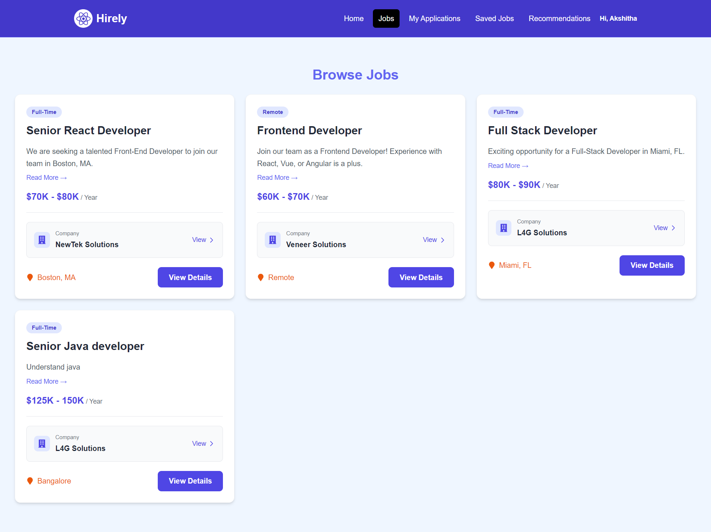

## Applications Page
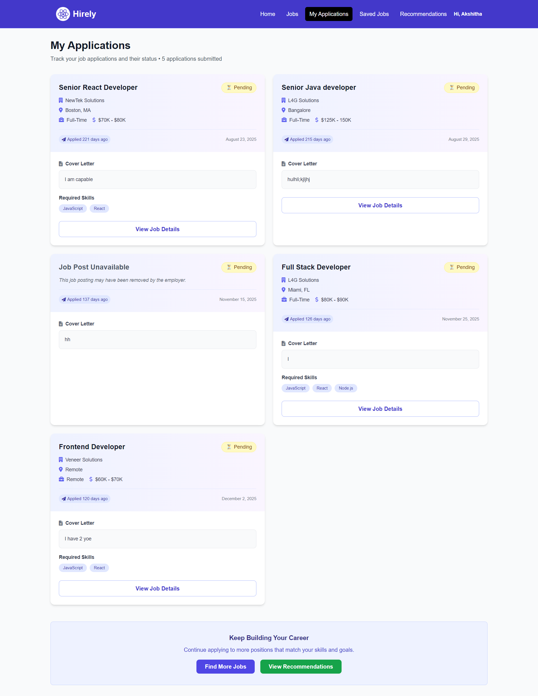

## Post Job Page
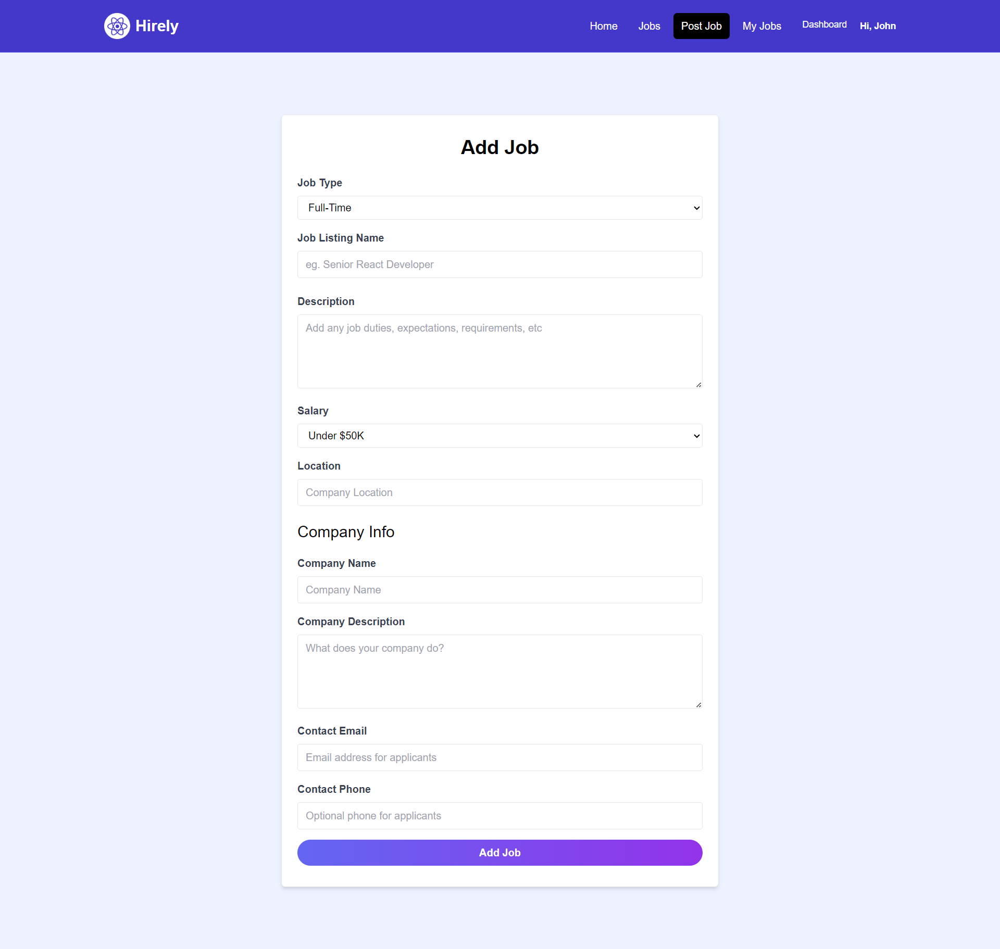

## Post Job Flow Step 2
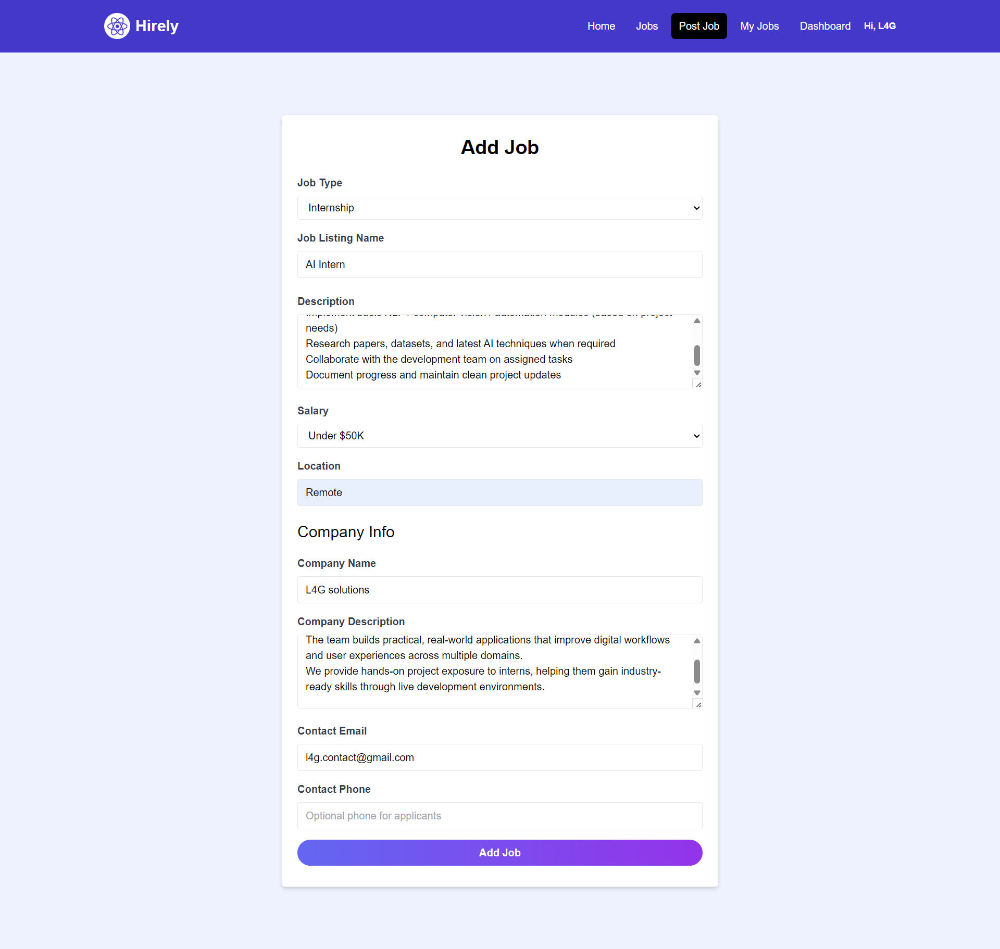

## Profile Page
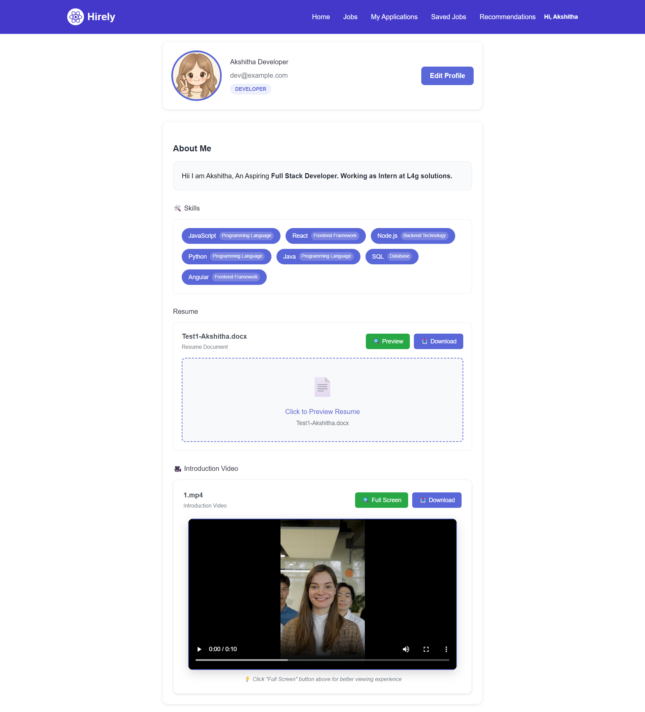

## Recommendation System
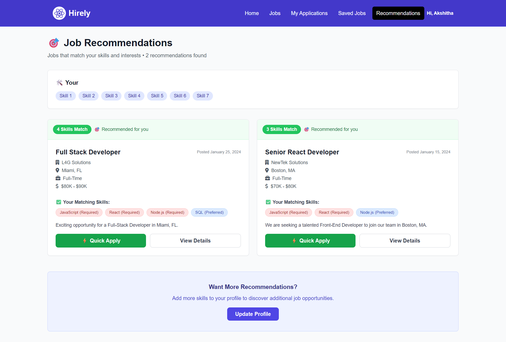

---

# ⚙️ Installation & Setup Guide

## Clone Repository

git clone <your-repository-link>
cd hirely

---

## Backend Setup

cd backend

Create virtual environment

python -m venv venv

Activate environment

Windows:
venv\Scripts\activate

Mac/Linux:
source venv/bin/activate

Install dependencies

pip install -r requirements.txt

Run migrations

python manage.py migrate

Start server

python manage.py runserver

Backend runs at:
http://127.0.0.1:8000

---

## Frontend Setup

cd frontend

Install dependencies

npm install

Run development server

npm run dev

Frontend runs at:
http://localhost:3000

---

# ☁️ AWS S3 Configuration

Set environment variables

AWS_ACCESS_KEY_ID
AWS_SECRET_ACCESS_KEY
AWS_STORAGE_BUCKET_NAME
AWS_REGION

Used for secure resume/media storage.

---

# 📂 Project Structure

hirely/

backend/

frontend/

screenshots/

README.md

---

# 🎯 Learning Outcomes

This project demonstrates

Full-stack architecture design

Django REST API development

AWS S3 file storage integration

Recruitment workflow system modeling

Frontend-backend communication

Production-style scalable structure

---

# 🚀 Future Improvements

Role-based access control

Interview scheduling system

Email notification service

Analytics dashboard

Docker deployment support

---

# 👨‍💻 Author

AKSH

Full Stack Developer | SDE Aspirant
